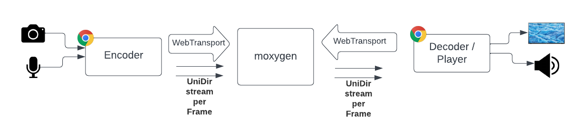
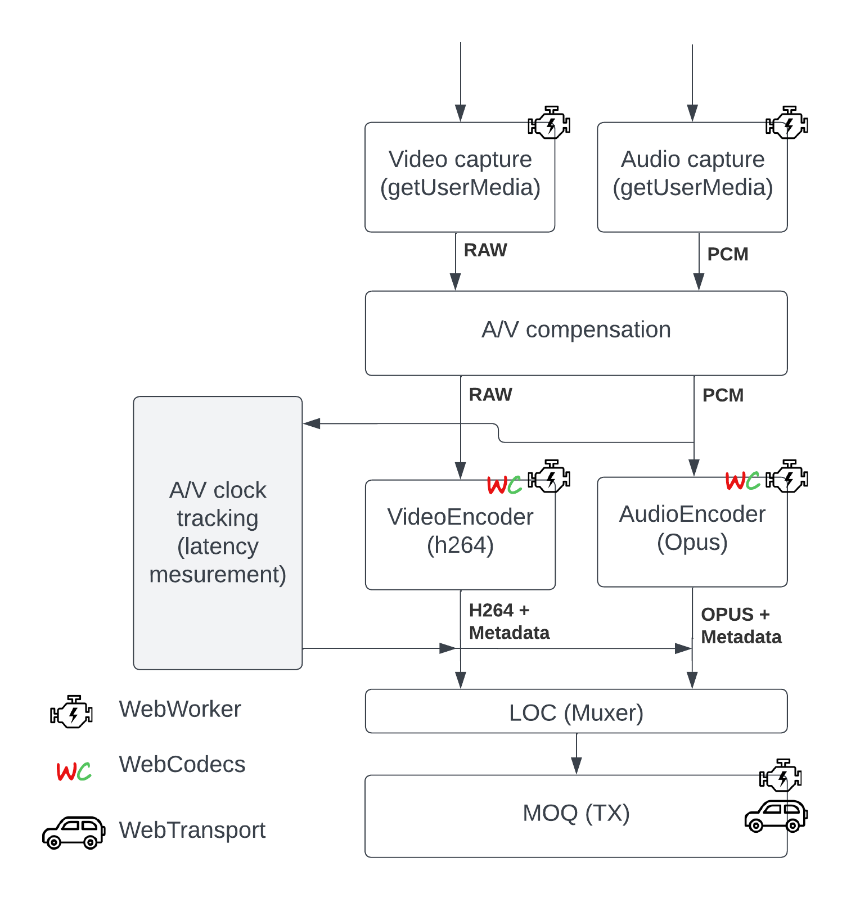
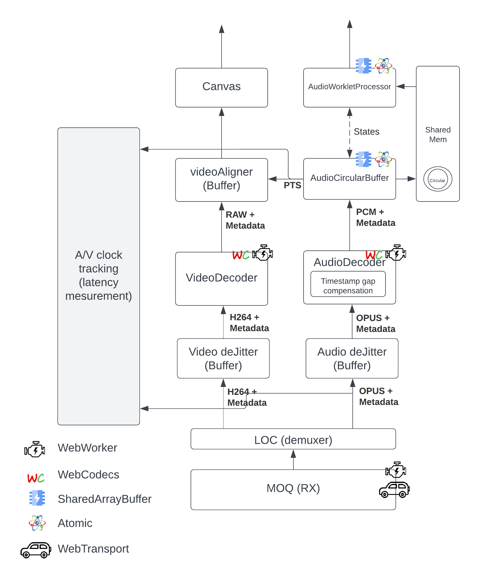

# moq-encoder-player

This project provides a minimal implementation (inside the browser) of a live video and audio encoder and video / audio player based on [MOQT draft-04](https://datatracker.ietf.org/doc/draft-ietf-moq-transport/04/). The goal is to provide a minimal live platform implementation that helps learning on low latency trade offs and facilitates experimentation.

It is NOT optimized for performance / production at all since the 1st goal is experimenting / learning.


Fig1: Main block diagram

For the server/relay side we have used [moxygen](https://github.com/facebookexperimental/moxygen).

Note: You need to be careful and check that protocol versions implemented by this code and moxygen matches

## Packager

It uses [draft-cenzano-moq-media-interop-00](https://datatracker.ietf.org/doc/draft-cenzano-moq-media-interop/)

## Encoder

The encoder implements MOQT publisher role. It is based on [Webcodecs](https://developer.mozilla.org/en-US/docs/Web/API/WebCodecs_API), and [AudioContext](https://developer.mozilla.org/en-US/docs/Web/API/AudioContext), see the block diagram in fig3


Fig3: Encoder block diagram

Note: We have used [WebTransport](https://www.w3.org/TR/webtransport/), so the underlying transport is QUIC (QUIC streams to be more accurate)

### Encoder - Config params

Video encoding config:

```javascript
// Video encoder config
const videoEncoderConfig = {
        encoderConfig: {
            codec: 'avc1.42001e', // Baseline = 66, level 30 (see: https://en.wikipedia.org/wiki/Advanced_Video_Coding)
            width: 320,
            height: 180,
            bitrate: 1_000_000, // 1 Mbps
            framerate: 30,
            latencyMode: 'realtime', // Sends 1 chunk per frame
        },
        encoderMaxQueueSize: 2,
        keyframeEvery: 60,
    };
```

Audio encoder config:

```javascript
// Audio encoder config
const audioEncoderConfig = {
        encoderConfig: {
            codec: 'opus', // AAC NOT implemented YET (it is in their roadmap)
            sampleRate: 48000, // To fill later
            numberOfChannels: 1, // To fill later
            bitrate: 32000,
            opus: { // See https://www.w3.org/TR/webcodecs-opus-codec-registration/
                frameDuration: 10000 // In us. Lower latency than default = 20000
            }
        },
        encoderMaxQueueSize: 10,
    };
```

Muxer config:

```javascript
const muxerSenderConfig = {
        urlHostPort: '',
        urlPath: '',

        moqTracks: {
            "audio": {
                id: 0,
                namespace: "vc",
                name: "aaa/audio",
                maxInFlightRequests: 100,
                isHipri: true,
                authInfo: "secret"
            },
            "video": {
                id: 1,
                namespace: "vc",
                name: "aaa/video",
                maxInFlightRequests: 50,
                isHipri: false,
                authInfo: "secret"
            }
        },
    }
```

### src_encoder/index.html

Main encoder webpage and also glues all encoder pieces together

- When it receives an audio OR video raw frame from `a_capture` or `v_capture`:
  - Adds it into `TimeBufferChecker` (for latency tracking)
  - Sends it to encoder

- When it receives an audio OR video encoded chunk from `a_encoder` or `v_encoder`:
  - Gets the wall clock generation time of 1st frame/sample in the chunk
  - Sends the chunk (augmented with wall clock, seqId, and metadata) to the muxer

### utils/TimeBufferChecker

Stores the frames timestamps and the wall clock generation time from the raw generated frames. That allows us keep track of each frame / chunk creation time (wall clock)

### capture/v_capture.js

[WebWorker](https://developer.mozilla.org/en-US/docs/Web/API/Web_Workers_API) that waits for the next RGB or YUV video frame from capture device, augments it adding wallclock, and sends it via post message to video encoder

### capture/a_capture.js

[WebWorker](https://developer.mozilla.org/en-US/docs/Web/API/Web_Workers_API) Receives the audio PCM frame (few ms, ~10ms to 25ms of audio samples) from capture device, augments it adding wallclock, and finally send it (doing copy) via post message to audio encoder

### encode/v_encoder.js

[WebWorker](https://developer.mozilla.org/en-US/docs/Web/API/Web_Workers_API) Encodes RGB or YUV video frames into encoded video chunks

- Receives the video RGB or YUV frame from `v_capture.js`
- Adds the video frame to a queue. And it keeps the queue smaller than `encodeQueueSize` (that helps when encoder is overwhelmed)
- Specifies I frames based on config var `keyframeEvery`
- It delivers the encoded chunks to the next stage (muxer)

Note: We configure `VideoEncoder` in `realtime` latency mode, so it delivers a chunk per video frame

### encode/a_encoder.js

[WebWorker](https://developer.mozilla.org/en-US/docs/Web/API/Web_Workers_API) Encodes PCM audio frames (samples) into encoded audio chunks

- Receives the audio PCM frame from `a_capture.js`
- Adds the audio frame to a queue. And it keeps the queue smaller than `encodeQueueSize` (that helps when encoder is overwhelmed)
- It delivers the encoded chunks to the next stage (muxer)

Note: `opus.frameDuration` setting helps keeping encoding latency low

### packager/mi_packager.js

- Implements [draft-cenzano-moq-media-interop-00](https://datatracker.ietf.org/doc/draft-cenzano-moq-media-interop/)

### sender/moq_sender.js

[WebWorker](https://developer.mozilla.org/en-US/docs/Web/API/Web_Workers_API) Implements MOQT and sends video and audio packets (see `mi_packager.js`) to the server / relay following MOQT and [draft-cenzano-moq-media-interop-00](https://datatracker.ietf.org/doc/draft-cenzano-moq-media-interop/)

- Opens a WebTransport session against the relay
- Implements MOQT publisher handshake for 2 tracks (opening control stream and announcing track namespace)
- **Creates a Unidirectional (encoder -> server) QUIC stream per every frame** (video and audio)
- Receives audio and video chunks from `a_encoder.js` and `v_encoder.js`
- It uses sendOrder to establish send priority. We use incremental counter (so new is higher priority than old), and we also increase audio priority over video (by adding an offset)
- It keeps number of inflight requests always below configured value `maxInFlightRequest`

## Player

The encoder implements MOQT subscriber role. It uses [Webcodecs](https://developer.mozilla.org/en-US/docs/Web/API/WebCodecs_API) and [AudioContext](https://developer.mozilla.org/en-US/docs/Web/API/AudioContext) / [Worklet](https://developer.mozilla.org/en-US/docs/Web/API/Worklet), [SharedArrayBuffer](https://developer.mozilla.org/en-US/docs/Web/JavaScript/Reference/Global_Objects/SharedArrayBuffer), and [Atomic](https://developer.mozilla.org/en-US/docs/Web/JavaScript/Reference/Global_Objects/Atomics)


Fig5: Player block diagram

### Audio video sync strategy

To keep the audio and video in-sync the following strategy is applied:

- Audio renderer (`audio_circular_buffer.js`) keeps track of last played timestamp (delivered to audio device by `source_buffer_worklet.js`) by using PTS value in the current playing `AudioData` frame and adding the duration of the number of samples delivered. This information is accessible from player page via `timingInfo.renderer.currentAudioTS`, who also adds the hardware latency provided by `AudioContext`.
- Every time we sent new audio samples to audio renderer the video renderer `video_render_buffer` (who contains YUV/RGB frames + timestamps) gets called and:
  - Returns / paints the oldest closest (or equal) frame to current audio ts (`timingInfo.renderer.currentAudioTS`)
  - Discards (frees) all frames older current ts (except the returned one)
- It is worth saying that `AudioDecoder` does NOT track timestamps, it just uses the 1st one sent and at every decoded audio sample adds 1/fs (so sample time). That means if we drop and audio packet those timestamps will be collapsed creating A/V out of sync. To work around that problem we calculate all the audio GAPs duration `timestampOffset` (by last playedTS - newTS, ideally = 0 if NO gaps), and we compensate the issued PTS by that.

### receiver/moq_demuxer_downloader.js

[WebWorker](https://developer.mozilla.org/en-US/docs/Web/API/Web_Workers_API) Implements MOQT and extracts video and audio packets (see `mi_packager.js`) from the server / relay following MOQT and [draft-cenzano-moq-media-interop-00](https://datatracker.ietf.org/doc/draft-cenzano-moq-media-interop/)

- Opens WebTransport session
- Implements MOQT subscriber handshake for 2 tracks (video and audio)
- Waits for incoming unidirectional (Server -> Player) QUIC streams
- For every received chunk (QUIC stream) we:
  - Demuxed it (see `mi_packager.js`)
  - Video: Create `EncodedVideoChunk`
    - Could be enhanced by init metadata, wallclock, and seqId
  - Audio: Create `EncodedAudioChunk`
    - Could be enhanced by init metadata, wallclock, and seqId

### utils/jitter_buffer.js

Since we do not have any guarantee that QUIC streams are delivered in order we need to order them before sending them to the decoder. This is the function of the deJitter. We create one instance per track, in this case one for Audio, one for video

- Receives the chunks from `moq_demuxer_downloader.js`
- Adds them into a sorted list, we sort by ascending `seqID`
- When list length (in ms is > `bufferSizeMs`) we deliver (remove) the 1st element in the list
- It also keeps track of delivered `seqID` detecting:
  - Gaps / discontinuities
  - Total QUIC Stream lost (not arrived in time)

### decode/audio_decoder.js

[WebWorker](https://developer.mozilla.org/en-US/docs/Web/API/Web_Workers_API) when it receives and audio chunk it decodes it and it sends the audio PCM samples to the audio renderer.
`AudioDecoder` does NOT track timestamps on decoded data, it just uses the 1st one sent and at every decoded audio sample adds 1/fs (so sample time). That means if we drop and audio packet those timestamps will be collapsed creating A/V out of sync.
To work around that problem we calculate all the audio GAPs duration `timestampOffset` and we publish that to allow other elements in the pipeline to have accurate idea of live head position

- Receives audio chunk
  - If discontinuity detected (reported by jitter_buffer.js) then calculate lost time by:
    - `lostTime = currentChunkTimestamp - lastChunkSentTimestamp;` Where `lastChunkSentTimestamp = lastSentChunk.timestamp + lastSentChunk.duration`
    - `timestampOffset += lostTime`
- Decode chunk and deliver PCM data

### render/audio_circular_buffer.js

Leverages [SharedArrayBuffer](https://developer.mozilla.org/en-US/docs/Web/JavaScript/Reference/Global_Objects/SharedArrayBuffer) and [Atomic](https://developer.mozilla.org/en-US/docs/Web/JavaScript/Reference/Global_Objects/Atomics) to implement following mechanisms to share data in a "multi thread" environment:

- Circular buffer (`sharedAudiobuffers`): Main buffer used to share audio PCM data from decoder to renderer `source_buffer_worklet.js`
- State communication (`sharedStates`): Use to share states and data between renderer `source_buffer_worklet.js` and main thread

### render/source_buffer_worklet.js

[AudioWorkletProcessor](https://developer.mozilla.org/en-US/docs/Web/API/Web_Workers_API), implements an audio source Worklet that sends audio samples to renderer.

- It reads new audio samples from circular buffer
- The samples are played at sampling freq rate
  - In case the buffer is exhausted (underrun) it will insert silence samples and notify timing according to that.
- Reports last PTS rendered (this is used to sync video to the audio track, so to keep A/V in sync)

### decode/video_decoder.js

[WebWorker](https://developer.mozilla.org/en-US/docs/Web/API/Web_Workers_API), Decodes video chunks and sends the decoded data (YUV or RGB) to the next stage (`video_render_buffer.js`)

- Initializes video decoder with init segment
- Sends video chunks to video decoder
  - If it detects a discontinuity drops all video frames until next IDR frame
- Sends the decoded frame to `video_render_buffer.js`

### render/video_render_buffer.js

Buffer that stores video decoded frames

- Received video decoded frames
- Allows the retrieval of video decoded frames via timestamps
  - Automatically drops all video frames that older than the currently requested

### Latency measurement based in video data
We can activate the option "Activate latency tracker (overlays data on video)" in the encoder (CPU consuming), this options will add the epoch ms clock of the encoder in the video frame as soon as it is received from the camera. It replaces the first video lines with that clock information. It is also encoded in a way that is resilient to video processing / encoding / decoding operations (see `./overlay_processor/overlay_encoder.js` and `./overlay_processor/overlay_decoder.js` in the code)

The player will decode that info from every frame and when it is about to show that frame it will calculate the latency by: `latency_ms = now_in_ms - frame_capture_in_ms`.

Note: This assumes the clocks of the encoder and the decoder are in-sync. Always true if you use same computer to encode and decode

### Legacy latency measurement

- Every audio and video received chunk `timestamp` and `clkms` (wall clock) is added into `latencyAudioChecker` and `latencyVideoChecker` queue (instances of `TimeBufferChecker`)
- The `renderer.currentAudioTS` (current audio sample rendered) is used to get the closest wall clock time from `audioTimeChecker`. From there we sync video.
- The UI displays: `Latency = Now - whenSampleWasGenerated`

Note: Encoder and Player clock have to be in sync for this metric to be accurate. If you use same computer as encoder & player then metric should be pretty accurate

## Local testing (localhost)

- Create key, certificate, and certificate fingerprint by running following script
```
./create_self_signed_certs.sh
```
Note: The trick here is that this script will create a self signed certificate for localhost with EDCSA and validity of 10 days (<15), this is the type Chrome will accept.

- Follow the installation instructions of  [moxygen](https://github.com/facebookexperimental/moxygen).
    - Remember to use key and certificate created on the previous step to run moxygen

- Clone this repo

```bash
git clone git@github.com:facebookexperimental/moq-encoder-player.git
```

- Install Python (see this [guide](https://realpython.com/installing-python/))

- Run local webserver by calling:

```bash
./start-http-server-cross-origin-isolated.py
```

Note: You need to use this script to **run the player** because it adds some needed headers (more info [here](https://developer.mozilla.org/en-US/docs/Web/JavaScript/Reference/Global_Objects/SharedArrayBuffer#security_requirements))

- Load encoder webpage, url: http://localhost:8080/src-encoder/?local
  - Click "Start"
- Load player webpage, url: http://localhost:8080/src-player/?local
  - Copy `Track Name` from encoder webpage and paste it into Receiver demuxer `Track Name`
  - Click "Start"

ENJOY YOUR POCing!!! :-)


Fig6: Encoder UI


Fig7: Player UI

Note: This is an experimentation code, we plan the evolve it quick, so those screenshots could be a bit outdated

## TODO

- Encoder: Cancel QUIC stream after some reasonable time (?) in mode live
- Player: Do not use main thread for anything except reporting
- Player/server: Cancel QUIC stream if arrives after jitter buffer
- Accelerate playback if we are over latency budget
- Fix dropped frames UI on VC player (not properly separated between encoder & player, see TODO in the code)
- Copy updates from event player to regular one
  - Better TS logging and video renderer
X - Fix player audio latency
  - Added new accurate metric based on embedded video data
- All:
  - Accept B frames (DTS)

## License

moq-encoder-player is released under the [MIT License](https://github.com/facebookincubator/rush/blob/master/LICENSE).

## TODO
- Add UI indication
- Check crash on stop for moxygen