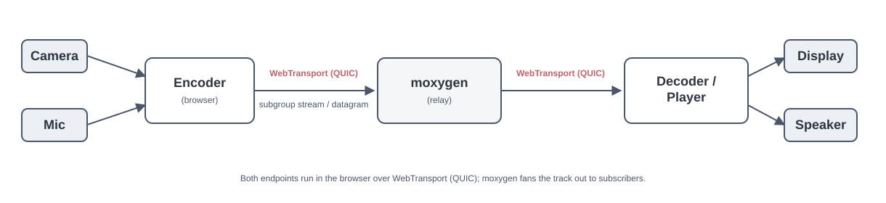
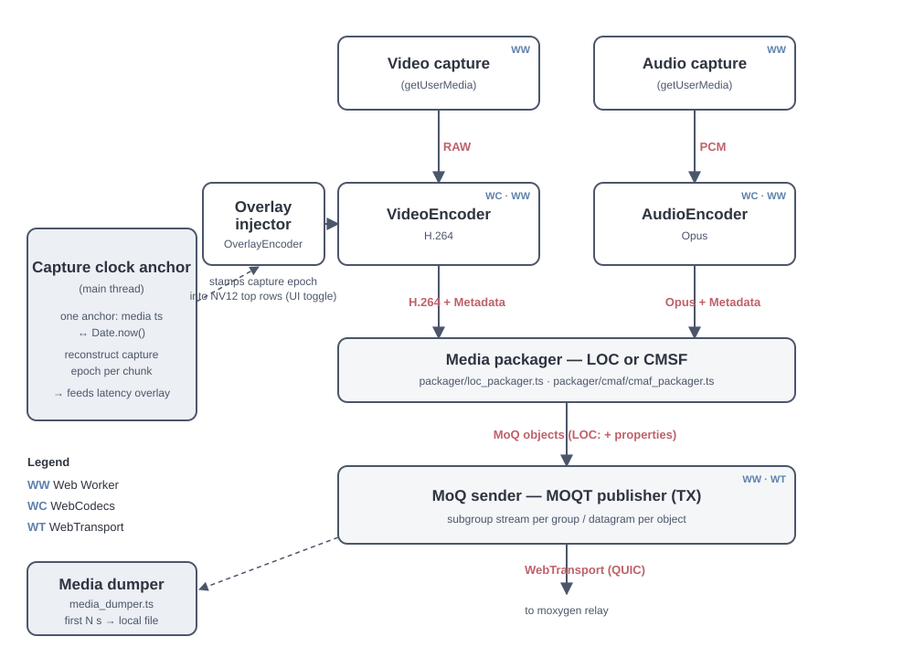
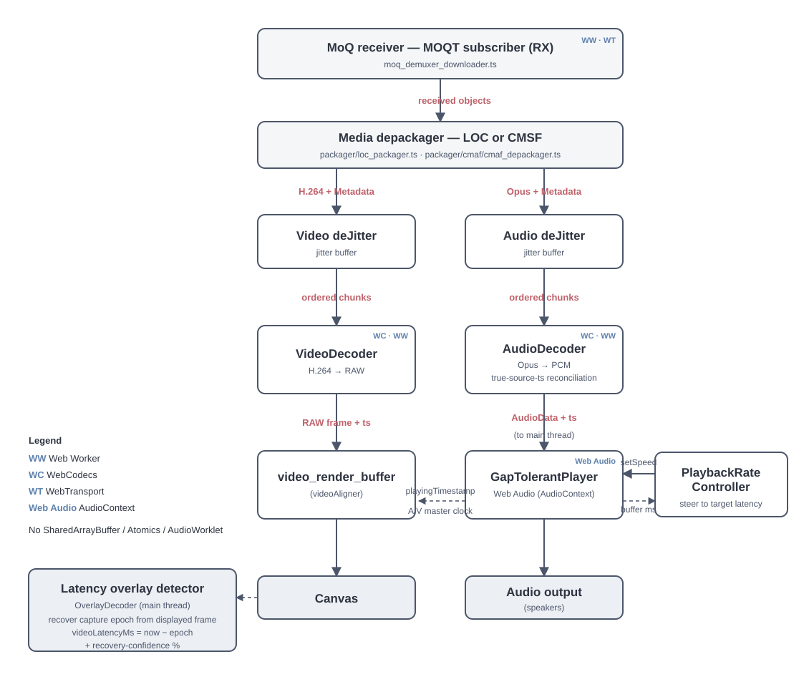
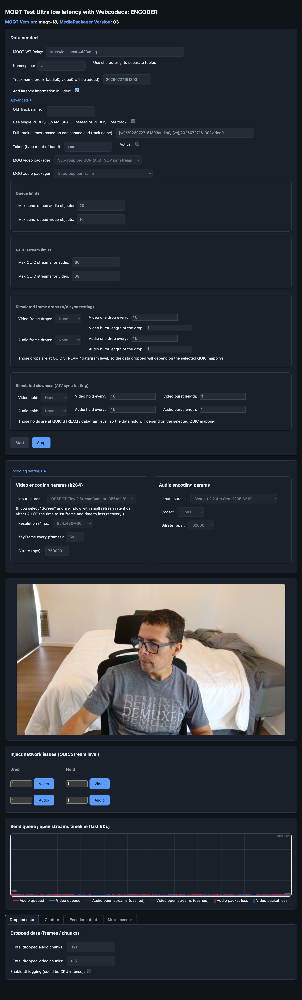
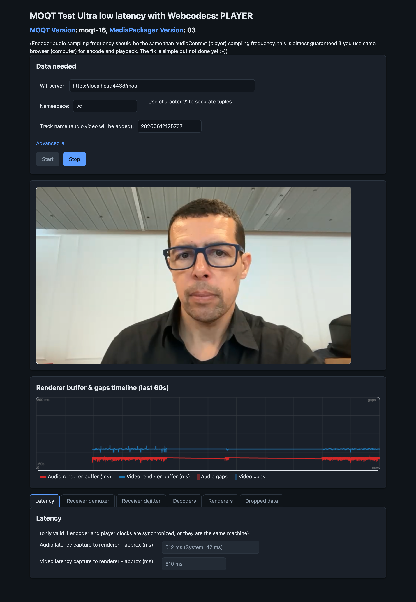

# moq-encoder-player

MOQT version: draft-18 (negotiated via ALPN token `moqt-18`). MoQ Media Interop packager version: 03

This project provides a minimal implementation (inside the browser) of a live video and audio encoder and video / audio player based on [MOQT draft](https://datatracker.ietf.org/doc/draft-ietf-moq-transport/), media transport is based on [draft-cenzano-moq-media-interop](https://datatracker.ietf.org/doc/draft-cenzano-moq-media-interop/), the exact versions of the drafts implemented are shown in the UI of the endoder and the player.

The goal if ths code is to provide a minimal live platform implementation that helps learning on low latency trade offs and facilitates experimentation.

It is NOT optimized for performance / production at all since the 1st goal is experimenting / learning.


Fig1: Main block diagram

For the server/relay side we have used [moxygen](https://github.com/facebookexperimental/moxygen).

Note: You need to be careful and check that protocol versions implemented by this code and moxygen matches

## TypeScript

The source code is written in [TypeScript](https://www.typescriptlang.org/) and lives under [`src/`](./src). It is compiled with `tsc` into native ES modules under `dist/` (mirroring the `src/` tree). The browser demos under [`demo/`](./demo) load the compiled output from `dist/` directly as ES module Web Workers / AudioWorklets, so **you must build the project before running the demos** (see [Development](#development-build-run-test)).

### Project structure

```
moq-encoder-player/
├── demo/                   # Browser demos (HTML). They load the compiled code from dist/
│   ├── encoder/            #   index.html (full encoder), simple.html
│   ├── player/             #   index.html (full player), simple.html
│   └── shared/             #   demo.css (styles shared by the demos)
├── src/                    # TypeScript source code
│   ├── index.ts            #   Library entry point (re-exports the reusable modules)
│   ├── capture/            #   a_capture.ts, v_capture.ts        (Web Workers)
│   ├── encode/             #   a_encoder.ts, v_encoder.ts        (Web Workers)
│   ├── decode/             #   audio_decoder.ts, video_decoder.ts (Web Workers)
│   ├── moq/                #   moq.ts (high-level Moq/Track/Subscription client),
│   │                       #   moqt.ts (wire protocol), varint.ts, byte_utils.ts, buffer_utils.ts,
│   │                       #   network_simulator.ts (send-path drop/hold impairments), README.md
│   ├── sender/             #   moq_sender.ts (worker shell) + moq/moq_sender_internals.ts   (MOQT publisher)
│   ├── receiver/           #   moq_demuxer_downloader.ts (worker shell) + moq/moq_receiver_internals.ts (MOQT subscriber)
│   ├── packager/           #   mi_packager.ts                    (media-interop packager)
│   ├── render/             #   audio_player.ts (Web Audio renderer), playback_rate_controller.ts,
│   │                       #   video_render_buffer.ts
│   ├── utils/              #   jitter_buffer.ts, ts_queue.ts, time_buffer_checker.ts, utils.ts,
│   │   └── media/          #   avcc_parser.ts, avc_decoder_configuration_record_parser.ts
│   └── types/              #   globals.d.ts (ambient types for WebTransport / WebCodecs)
├── tests/                  # Jest unit tests for the pure utilities
├── dist/                   # Compiled JavaScript + type declarations (generated, git-ignored)
├── .github/workflows/      # CI: lint + build + test
├── tsconfig.json           # TypeScript compiler options
├── jest.config.js          # Test runner configuration
├── eslint.config.js        # ESLint configuration (flat config)
├── .prettierrc             # Prettier configuration
└── package.json            # NPM dependencies, scripts and metadata
```

## Development (build, run, test)

Requirements: [Node.js](https://nodejs.org/) 18+ (for the toolchain) and [Python 3](https://realpython.com/installing-python/) (for the local dev web server). The included dev server also sets cross-origin-isolation headers, but the player no longer requires them (audio playback dropped `SharedArrayBuffer`); any static server over HTTPS works.

Install dependencies once:

```bash
npm install
```

### Run locally (development)

```bash
# 1. Compile TypeScript -> dist/ and start the cross-origin-isolated web server on :8080
npm run dev
```

`npm run dev` runs `npm run build` followed by `npm run serve`. While iterating on the TypeScript you can keep the compiler running in watch mode in one terminal and the server in another:

```bash
npm run build:watch   # terminal 1: re-compile on every change
npm run serve         # terminal 2: serve the repo on http://localhost:8080
```

Then open the demos (see [Testing](#testing-encoder-player-served-from-localhost) below for the full flow):

- Encoder: <http://localhost:8080/demo/encoder/?local>
- Player: <http://localhost:8080/demo/player/?local>

### Build for production

```bash
npm run build     # type-checks and emits dist/*.js + dist/*.d.ts (declarations)
```

The contents of `dist/` are everything needed at runtime (the demos and any external consumer import from there). `npm run clean` removes the `dist/` folder.

### Run tests

```bash
npm test          # run the Jest unit test suite once
npm run test:watch
```

### Lint & format

```bash
npm run lint          # ESLint
npm run lint:fix
npm run format        # Prettier (write)
npm run format:check
```

CI (GitHub Actions, see [`.github/workflows/main.yml`](./.github/workflows/main.yml)) runs `lint`, `build` and `test` on every push / pull request.

## Packager

It uses [draft-cenzano-moq-media-interop](https://datatracker.ietf.org/doc/draft-cenzano-moq-media-interop/)

## Encoder

The encoder implements MOQT publisher role. It is based on [Webcodecs](https://developer.mozilla.org/en-US/docs/Web/API/WebCodecs_API), and [AudioContext](https://developer.mozilla.org/en-US/docs/Web/API/AudioContext), see the block diagram in fig3


Fig3: Encoder block diagram

Note: We have used [WebTransport](https://www.w3.org/TR/webtransport/), so the underlying transport is QUIC (QUIC streams to be more accurate)

### Encoder - Config params

Video encoding config:

```javascript
// Video encoder config
const videoEncoderConfig = {
        encoderConfig: {
            codec: 'avc1.42001e', // Baseline = 66, level 30 (see: https://en.wikipedia.org/wiki/Advanced_Video_Coding)
            width: 320,
            height: 180,
            bitrate: 1_000_000, // 1 Mbps
            framerate: 30,
            latencyMode: 'realtime', // Sends 1 chunk per frame
        },
        encoderMaxQueueSize: 2,
        keyframeEvery: 60,
    };
```

Audio encoder config:

```javascript
// Audio encoder config
const audioEncoderConfig = {
        encoderConfig: {
            codec: 'opus', // AAC NOT implemented YET (it is in their roadmap)
            sampleRate: 48000, // To fill later
            numberOfChannels: 1, // To fill later
            bitrate: 32000,
            opus: { // See https://www.w3.org/TR/webcodecs-opus-codec-registration/
                frameDuration: 10000 // In us. Lower latency than default = 20000
            }
        },
        encoderMaxQueueSize: 10,
    };
```

Muxer config:

```javascript
const muxerSenderConfig = {
        urlHostPort: '',
        urlPath: '',

        keepAlivesEveryMs: 5000,

        certificateHash: null,

        // Announce each namespace once with PUBLISH_NAMESPACE and serve tracks
        // lazily on subscribe, instead of one PUBLISH per track.
        usePublishNamespace: true,

        moqTracks: {
            "audio": {
                namespace: ["vc"],               // namespace tuple (array of segments)
                name: "audio0",
                maxInFlightRequests: 20,          // caps the per-track send queue
                maxOpenStreams: 60,               // caps concurrent open subgroup streams
                isHipri: true,
                authInfo: "secret",
                moqMapping: MOQ_MAPPING_SUBGROUP_PER_GROUP, // or MOQ_MAPPING_OBJECT_PER_DATAGRAM
            },
            "video": {
                namespace: ["vc"],
                name: "video0",
                maxInFlightRequests: 10,
                maxOpenStreams: 39,
                isHipri: false,
                authInfo: "secret",
                moqMapping: MOQ_MAPPING_SUBGROUP_PER_GROUP,
            }
        },
    }
```

`moqMapping` selects how objects hit the QUIC wire (see [`src/moq/README.md`](./src/moq/README.md)):
`MOQ_MAPPING_SUBGROUP_PER_GROUP` (one unidirectional stream per group) or
`MOQ_MAPPING_OBJECT_PER_DATAGRAM` (one datagram per object). Both are selectable
per track from the encoder UI.

### demo/encoder/index.html

Main encoder webpage and also glues all encoder pieces together

- When it receives an audio OR video raw frame from `a_capture` or `v_capture`:
  - Adds it into `TimeBufferChecker` (for latency tracking)
  - Sends it to encoder

- When it receives an audio OR video encoded chunk from `a_encoder` or `v_encoder`:
  - Gets the wall clock generation time of 1st frame/sample in the chunk
  - Sends the chunk (augmented with wall clock, seqId, and metadata) to the muxer

### src/utils/time_buffer_checker.ts (TimeBufferChecker)

Stores the frames timestamps and the wall clock generation time from the raw generated frames. That allows us keep track of each frame / chunk creation time (wall clock)

### src/capture/v_capture.ts

[WebWorker](https://developer.mozilla.org/en-US/docs/Web/API/Web_Workers_API) that waits for the next RGB or YUV video frame from capture device, augments it adding wallclock, and sends it via post message to video encoder

### src/capture/a_capture.ts

[WebWorker](https://developer.mozilla.org/en-US/docs/Web/API/Web_Workers_API) Receives the audio PCM frame (few ms, ~10ms to 25ms of audio samples) from capture device, augments it adding wallclock, and finally send it (doing copy) via post message to audio encoder

### src/encode/v_encoder.ts

[WebWorker](https://developer.mozilla.org/en-US/docs/Web/API/Web_Workers_API) Encodes RGB or YUV video frames into encoded video chunks

- Receives the video RGB or YUV frame from `v_capture.ts`
- Adds the video frame to a queue. And it keeps the queue smaller than `encodeQueueSize` (that helps when encoder is overwhelmed)
- Specifies I frames based on config var `keyframeEvery`
- It delivers the encoded chunks to the next stage (muxer)

Note: We configure `VideoEncoder` in `realtime` latency mode, so it delivers a chunk per video frame

### src/encode/a_encoder.ts

[WebWorker](https://developer.mozilla.org/en-US/docs/Web/API/Web_Workers_API) Encodes PCM audio frames (samples) into encoded audio chunks

- Receives the audio PCM frame from `a_capture.ts`
- Adds the audio frame to a queue. And it keeps the queue smaller than `encodeQueueSize` (that helps when encoder is overwhelmed)
- It delivers the encoded chunks to the next stage (muxer)

Note: `opus.frameDuration` setting helps keeping encoding latency low

### src/packager/mi_packager.ts

- Implements [draft-cenzano-moq-media-interop](https://datatracker.ietf.org/doc/draft-cenzano-moq-media-interop/)

### src/sender/moq_sender.ts (+ src/sender/moq/moq_sender_internals.ts)

[WebWorker](https://developer.mozilla.org/en-US/docs/Web/API/Web_Workers_API) that implements the MOQT publisher role and sends video and audio packets (see `mi_packager.ts`) to the server / relay following MOQT and [draft-cenzano-moq-media-interop](https://datatracker.ietf.org/doc/draft-cenzano-moq-media-interop/).

`moq_sender.ts` is a thin worker shell; the publisher logic lives in `MoqSender` (`src/sender/moq/moq_sender_internals.ts`), which drives the shared, media-free `Moq` client in [`src/moq/moq.ts`](./src/moq/moq.ts) (fully documented in [`src/moq/README.md`](./src/moq/README.md)).

- Opens a WebTransport session against the relay (MOQT version negotiated via ALPN)
- Announces its track(s): either one `PUBLISH` per track, or a single `PUBLISH_NAMESPACE` per namespace serving tracks lazily on subscribe (`usePublishNamespace`)
- Receives audio and video chunks from `a_encoder.ts` and `v_encoder.ts` and publishes each as a MoQ object via `track.sendObject(...)`
- **Object → QUIC wire mapping is configurable per track** (`moqMapping`): `SubgroupPerGroup` opens one unidirectional QUIC stream per group (a video keyframe starts a new group/stream), while `ObjectPerDatagram` sends one datagram per object
- Send priority uses the MoQ publisher priority carried on each group; audio is published at a higher priority than video (lower numeric value = higher priority)
- It keeps the per-track send queue below `maxInFlightRequests` and the concurrent open subgroup streams below `maxOpenStreams` (objects / whole groups are dropped once the respective cap is reached). Two stats are reported per track: `numQueued` (objects waiting in the send queue) and `numOpenStreams` (open QUIC subgroup streams)
- Optional send-path impairments (`src/moq/network_simulator.ts`) can drop or hold bursts of wire units to test A/V sync and loss recovery; both are exposed from the encoder UI

## Player

The encoder implements MOQT subscriber role. It uses [Webcodecs](https://developer.mozilla.org/en-US/docs/Web/API/WebCodecs_API) and [AudioContext](https://developer.mozilla.org/en-US/docs/Web/API/AudioContext) (audio is scheduled with `AudioBufferSourceNode` on the AudioContext clock — no `SharedArrayBuffer` or AudioWorklet)


Fig5: Player block diagram

### Audio video sync strategy

To keep the audio and video in-sync the following strategy is applied:

- Audio renderer (`audio_player.ts`, `GapTolerantPlayer`) schedules each decoded `AudioData` frame on the AudioContext clock and exposes the media timestamp currently sounding at the speakers (already latency-adjusted) via its `playingTimestamp` stat. The player page mirrors it into `timingInfo.renderer.currentAudioTS`.
- Every time the stats callback fires (and in the render loop) the video renderer `video_render_buffer` (who contains YUV/RGB frames + timestamps) gets called and:
  - Returns / paints the oldest closest (or equal) frame to current audio ts (`timingInfo.renderer.currentAudioTS`)
  - Discards (frees) all frames older current ts (except the returned one)
- `AudioDecoder` does NOT track timestamps, it just uses the 1st one sent and at every decoded audio sample adds 1/fs (so sample time). Rather than compute an explicit gap offset, `audio_decoder.ts` mirrors the decoder's input queue and reconciles it on the `dequeue` event so each output frame carries the **true source timestamp** of the chunk that produced it; `GapTolerantPlayer` re-anchors media time to that timestamp whenever a new contiguous segment starts (after an underrun/gap).

### src/receiver/moq_demuxer_downloader.ts

[WebWorker](https://developer.mozilla.org/en-US/docs/Web/API/Web_Workers_API) entry point. It is a thin shell that forwards worker messages to the `MoqReceiver` class in `src/receiver/moq/moq_receiver_internals.ts`, mirroring the publisher layout (`src/sender/`).

The MOQT subscriber logic is split in two layers:

- `src/moq/moq.ts` — the high-level, media-free `Moq` client (shared with the publisher). It owns the WebTransport session, the control loop, the SUBSCRIBE handshake (`Moq.subscribe` → `Subscription`), and the incoming stream / datagram receive loops. Received object payloads are routed to the matching `Subscription` by track alias.
- `src/receiver/moq/moq_receiver_internals.ts` — `MoqReceiver` translates worker messages into `Moq` calls and demuxes the received payloads (see `mi_packager.ts`) into `EncodedVideoChunk` / `EncodedAudioChunk` for the rest of the player pipeline.

It implements MOQT and extracts video and audio packets from the server / relay following MOQT and [draft-cenzano-moq-media-interop](https://datatracker.ietf.org/doc/draft-cenzano-moq-media-interop/):

- Opens WebTransport session
- Implements MOQT subscriber handshake for 2 tracks (video and audio)
- Waits for incoming unidirectional (Server -> Player) QUIC streams (and datagrams)
- For every received chunk (QUIC stream) we:
  - Demuxed it (see `mi_packager.ts`)
  - Video: Create `EncodedVideoChunk`
    - Could be enhanced by init metadata and wallclock
  - Audio: Create `EncodedAudioChunk`
    - Could be enhanced by init metadata and wallclock

### src/utils/jitter_buffer.ts

Since we do not have any guarantee that QUIC streams are delivered in order we need to order them before sending them to the decoder. This is the function of the deJitter. We create one instance per track, in this case one for Audio, one for video

- Receives the chunks from `moq_demuxer_downloader.ts`
- Adds them into a sorted list ordered by the MoQ transport-native key `(groupId, objId)` (lexicographic), which reproduces the publisher's send order
- When list length (in ms is > `bufferSizeMs`) we deliver (remove) the 1st element in the list
- It also keeps track of the last delivered `(groupId, objId)` detecting:
  - Gaps / discontinuities
  - Total QUIC Stream lost (not arrived in time)

### src/decode/audio_decoder.ts

[WebWorker](https://developer.mozilla.org/en-US/docs/Web/API/Web_Workers_API) that decodes each audio chunk and posts the decoded `AudioData` frames (with a timestamp) to the main-thread renderer.
`AudioDecoder` does NOT track timestamps on decoded data, it just uses the 1st one sent and at every decoded audio sample adds 1/fs (so sample time). That means a dropped audio packet would collapse the timeline and desync A/V.

To recover the true position it mirrors the decoder's input queue (`pendingTs`) and reconciles it on the `dequeue` event:

- Receives audio chunk → push `chunk.timestamp` to `pendingTs`, then `decode()`.
- On `dequeue`: `consumed = pendingTs.length - decodeQueueSize`; the most recent consumed chunk's timestamp becomes the timestamp for the frames about to be output.
- Posts `{ type: 'aframe', frame, ts }` — `ts` is the **true source timestamp** of the chunk that produced the frame. The renderer uses it to anchor media time on a resume, superseding the old explicit gap-offset compensation.

### src/render/audio_player.ts

`GapTolerantPlayer` — the Web Audio renderer. It keeps a `nextPlayTime` cursor on the AudioContext clock and schedules each decoded frame with an `AudioBufferSourceNode`:

- `addFrame(audioData, ts)`: converts the `AudioData` to an `AudioBuffer` and starts it at `nextPlayTime`, then advances the cursor by the frame's duration.
- Gap tolerance: if the network stalls, `nextPlayTime` falls into the past; the player resumes at `currentTime` (clamped) so late audio plays immediately instead of piling up. A real gap re-pads the `jitterDelay` cushion and re-anchors media time to the incoming frame's `ts`.
- Exposes `playingTimestamp` (media time currently at the speakers, already latency-adjusted) via its `onStats` callback — the A/V master clock.

No `SharedArrayBuffer`, `Atomics`, or AudioWorklet are used, so the player no longer needs cross-origin isolation.
- Reports last PTS rendered (this is used to sync video to the audio track, so to keep A/V in sync)

### src/render/playback_rate_controller.ts

`PlaybackRateController` keeps the audio render buffer (a proxy for latency) near a configurable target by nudging the playback speed. It is a hysteresis controller (decision-only): when the buffer leaves an on-target band it commands `GapTolerantPlayer.setPlaybackSpeed` to speed up (drain an over-full buffer) or slow down (refill an under-full one), holding the correction until the buffer crosses back to the target. The player UI exposes the target latency, on-target band, and speed-up / slow-down rates, and lets you toggle speed compensation on/off. (Note: changing `playbackRate` also shifts pitch.)

### src/decode/video_decoder.ts

[WebWorker](https://developer.mozilla.org/en-US/docs/Web/API/Web_Workers_API), Decodes video chunks and sends the decoded data (YUV or RGB) to the next stage (`video_render_buffer.ts`)

- Initializes video decoder with init segment
- Sends video chunks to video decoder
  - If it detects a discontinuity drops all video frames until next IDR frame
- Sends the decoded frame to `video_render_buffer.ts`

### src/render/video_render_buffer.ts

Buffer that stores video decoded frames

- Received video decoded frames
- Allows the retrieval of video decoded frames via timestamps
  - Automatically drops all video frames that older than the currently requested

### Latency measurement

- Every audio and video received chunk `timestamp` and `clkms` (wall clock) is added into `latencyAudioChecker` and `latencyVideoChecker` queue (instances of `TimeBufferChecker`)
- The `renderer.currentAudioTS` (current audio sample rendered) is used to get the closest wall clock time from `audioTimeChecker`. From there we sync video.
- The UI displays: `Latency = Now - whenSampleWasGenerated`

Note: Encoder and Player clock have to be in sync for this metric to be accurate. If you use same computer as encoder & player then metric should be pretty accurate

## testing (encoder player served from localhost)

- Clone this repo

```bash
git clone git@github.com:facebookexperimental/moq-encoder-player.git
```

- Install [Node.js](https://nodejs.org/) 18+ and [Python](https://realpython.com/installing-python/)

- Install dependencies and build the TypeScript into `dist/`:

```bash
npm install
npm run build
```

- Run local webserver by calling:

```bash
./start-http-server-cross-origin-isolated.py
```

Note: It is better to run webserver using this script (or `npm run serve`) but you can use any webserver you like to publish the `.` directory (repo directory). The demos load the compiled code from `dist/`, so remember to (re)run `npm run build` after changing any TypeScript.

- Load encoder webpage, url: http://localhost:8080/demo/encoder/?local
  - Click "Start"
- Load player webpage, url: http://localhost:8080/demo/player/?local
  - Copy `Track Name` from encoder webpage and paste it into Receiver demuxer `Track Name`
  - Click "Start"

ENJOY YOUR POCing!!! :-)


Fig6: Encoder UI


Fig7: Player UI

Note: This is an experimentation code, we plan the evolve it quick, so those screenshots could be a bit outdated

## Local testing (encoder-player served and moxygen served from localhost)

- Create key, certificate, and certificate fingerprint by running following script
```
./create_self_signed_certs.sh
```
Note: The trick here is that this script will create a self signed certificate for localhost with EDCSA and validity of 10 days (<15), this is the type Chrome will accept.

- Follow the installation instructions of  [moxygen](https://github.com/facebookexperimental/moxygen).
    - Remember to use key and certificate created on the previous step to run moxygen

- Clone this repo

```bash
git clone git@github.com:facebookexperimental/moq-encoder-player.git
```

- Install [Node.js](https://nodejs.org/) 18+ and [Python](https://realpython.com/installing-python/)

- Install dependencies and build the TypeScript into `dist/`:

```bash
npm install
npm run build
```

- Run local webserver by calling:

```bash
./start-http-server-cross-origin-isolated.py
```

Note: this script adds cross-origin-isolation headers. The player no longer requires them (audio playback dropped `SharedArrayBuffer`), so any static HTTPS server works — but this script remains a convenient default.

- Load encoder webpage, url: http://localhost:8080/demo/encoder/?local
  - Click "Start"
- Load player webpage, url: http://localhost:8080/demo/player/?local
  - Copy `Track Name` from encoder webpage and paste it into Receiver demuxer `Track Name`
  - Click "Start"

ENJOY YOUR POCing!!! :-)

You should see same UI that is shown in testing section above

## TODO
- Adopt LOCvX instead of MOQ-MI
  - OK Check video extradata
    - Init at 1st keyframe, carries AVCDecoderConfigurationRecord as metadata
    - Codec string extracted from AVCDecoderConfigurationRecord
  - Check audio extradata
    - LOC says description field of webcodecs (CHECK)
    - Webcodecs audio decoder needs sampleRate, channels, and codecstring
    - AAC use extradata, no need
  - Get rid of wallclock (latency)
  - IsDisco is in LOC, how to add it
- Add latency in band (video)
- Fix latency measurement, it is broken (at least after update target)
- Add new A/V sync strategy to docs
X - Get rid of duration (de jitter) — done on the player side (buffers derive occupancy from PTS spans); still generated by the encoder and carried on the wire
X - Get rid seqId — done on the player side (it dejitters on `(groupId, objId)`); still generated by the encoder and carried on the wire
X - Get rid of dts — done on the player side (parser skips it, never decoded); still generated by the encoder and carried on the wire

- Check token in all messages, not just when encoder receives SUBSCRIBE
- When it drops 100+ audio streams it breaks (I’m guessing I’m trying to send 100 streams at same time hitting browser limit)
- Encoder: Cancel QUIC stream after some reasonable time (?) in mode live
- Player: Do not use main thread for anything except reporting
- Player/server: Cancel QUIC stream if arrives after jitter buffer
- All:
  - Accept B frames (DTS)


## License

moq-encoder-player is released under the [MIT License](https://github.com/facebookincubator/rush/blob/master/LICENSE).
