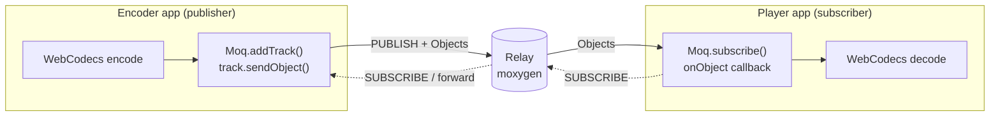
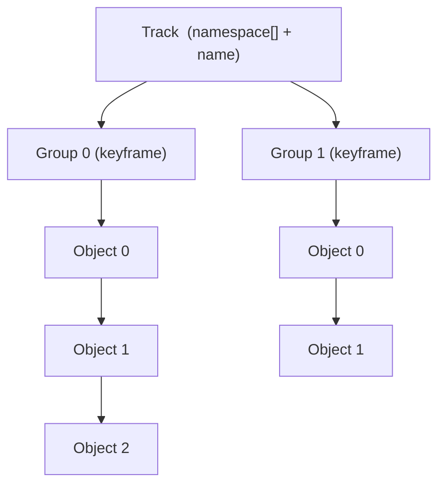
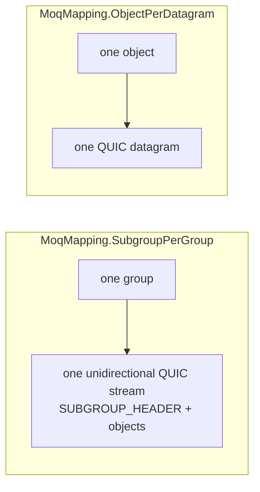
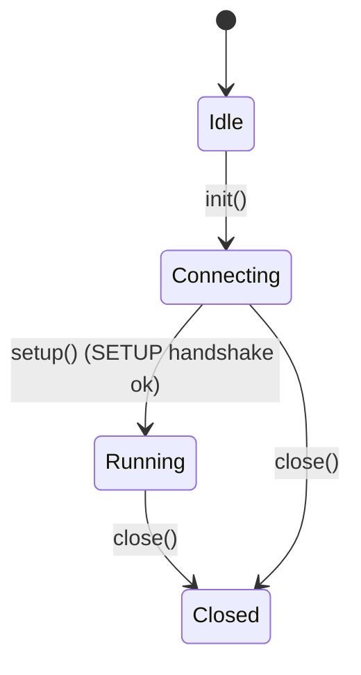
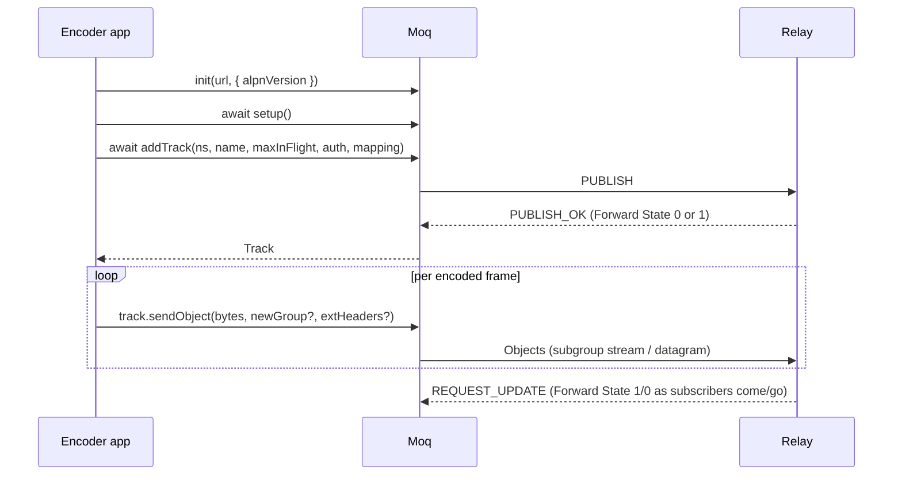
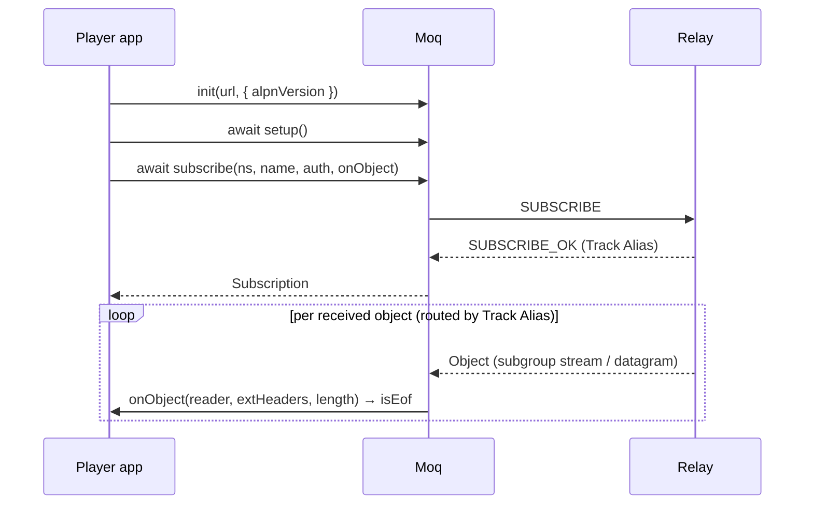

# `Moq` — high-level Media over QUIC client

`src/moq/moq.ts` provides a small, **media-free** client API for
[Media over QUIC Transport (MoQT)](https://datatracker.ietf.org/doc/draft-ietf-moq-transport/)
**draft‑16**, running in the browser over **WebTransport**. It wraps the
low-level wire codec in [`moqt.ts`](./moqt.ts) and the varint codec in
[`varint.ts`](./varint.ts) and exposes three small classes:

| Class | Role | Created by |
|-------|------|------------|
| [`Moq`](#moq) | The session: transport, SETUP handshake, control loop | `new Moq()` |
| [`Track`](#track) | A track you **publish** | `moq.addTrack(...)` |
| [`Subscription`](#subscription) | A track you **subscribe** to | `moq.subscribe(...)` |
| [`ObjData`](#objdata) | A handle to one published object | `track.sendObject(...)` |

"Media-free" means `Moq` only moves **opaque byte payloads** plus MoQ object
extension headers. Encoding/packaging (e.g. the MoQMI packager in
[`../packager/mi_packager.ts`](../packager/mi_packager.ts)) and decoding live in
the caller. The publish and subscribe workers that use this API are in
[`../sender/moq/`](../sender/moq) and [`../receiver/moq/`](../receiver/moq).

---

## 1. Context & data model

MoQT is a publish/subscribe protocol. A **publisher** produces a **track**; one
or more **subscribers** receive it, usually through a **relay** (e.g. moxygen)
that fans the track out to many subscribers.



### Track → Group → Object

A track is an ordered set of **groups**; each group is a set of **objects**.
A group is a *join point*: a subscriber can start decoding at the beginning of a
group (for video, a group starts at a keyframe).



Each object carries: `groupId`, `objId`, a **publisher priority**, optional
**extension headers** (key/value pairs — e.g. MoQMI media metadata), and the
opaque **payload**.

### Object → wire mapping ([`MoqMapping`](#moqmapping))

A track chooses how its objects hit the QUIC wire:



- **`SubgroupPerGroup`** — reliable, ordered; one stream per group. Good for
  video (a stream can be reset/cancelled to drop a stale group).
- **`ObjectPerDatagram`** — one datagram per object; lower latency, no
  retransmission. Good for audio.

---

## 2. Session lifecycle

`Moq` moves through [`MoqState`](#moqstate):



- **`init()` is synchronous** and returns immediately; it opens the WebTransport
  connection and the control stream in the background.
- **`setup()`** awaits that readiness, performs the CLIENT/SERVER_SETUP
  handshake, and starts the background control loop. The MoQT **version is
  negotiated by the transport via ALPN / `WT-Available-Protocols`** (draft‑16),
  so `setup()` carries no version argument.
- `addTrack()` / `subscribe()` also await readiness, so you can call them right
  after `setup()`.

### Publish flow



> **Forward State gating.** A relay typically replies `PUBLISH_OK` with **Forward
> State 0** ("I have no subscribers yet") and later sends `REQUEST_UPDATE` to flip
> it to 1 when a subscriber appears (and back to 0 when the last one leaves).
> While Forward State is 0, `track.sendObject()` returns objects with status
> `dropped` and nothing is sent — so you don't waste uplink when nobody is
> watching. When it flips back to 1, the track resumes on a **fresh group**.

### Subscribe flow



If the publisher (relay) rejects the subscription, `subscribe()` **retries
automatically** every 2s with a fresh request id until it succeeds.

---

## 3. API reference

### `Moq`

The session. One per WebTransport connection. Handles both roles (you can
publish and subscribe on the same session).

#### Properties

| Property | Type | Description |
|----------|------|-------------|
| `state` | `MoqState` (get) | Current lifecycle state. |

#### Methods

```ts
init(urlHostPort: string, options?: MoqInitOptions): void
```
Open the transport. **Synchronous**; connection setup runs in the background.
`urlHostPort` is coerced to `https://…` (WebTransport requirement). See
[`MoqInitOptions`](#moqinitoptions).

```ts
setup(keepAliveOpts?: KeepAliveOptions): Promise<void>
```
Await connection readiness, run the SETUP handshake, and start the control loop.
Throws if called before `init()`. Pass [`KeepAliveOptions`](#keepaliveoptions) to
enable the idle keep-alive loop. Moves the session to `Running`.

```ts
addTrack(
  namespace: string[],
  name: string,
  maxInFlightRequests: number,
  authInfo: string | undefined,
  moqMapping: MoqMapping,
): Promise<Track>
```
Publish a track: sends `PUBLISH` and resolves with a [`Track`](#track) once the
peer replies `PUBLISH_OK`. `namespace` is a tuple (array) of name segments;
`name` is the track name. `maxInFlightRequests` bounds the per-track send queue
(`<= 0` means unbounded). `authInfo` is an optional auth token string.

```ts
subscribe(
  namespace: string[],
  name: string,
  authInfo: string | undefined,
  onObject: ObjectCallback,
): Promise<Subscription>
```
Subscribe to a track: sends `SUBSCRIBE`, resolves with a
[`Subscription`](#subscription) on `SUBSCRIBE_OK`, and routes every received
object to `onObject` (see [`ObjectCallback`](#objectcallback)). Retries on error.

```ts
close(): void
```
Tear down the session. **Synchronous**; closes tracks (sending `PUBLISH_DONE`),
unsubscribes, and closes the transport in the background. Idempotent.

---

### `Track`

A track you publish. Owns a per-track send queue, group/object sequencing, the
open subgroup stream(s), and Forward State.

#### Properties

| Property | Type | Description |
|----------|------|-------------|
| `namespace` | `string[]` | Track namespace tuple. |
| `name` | `string` | Track name. |
| `trackAlias` | `number` | Numeric alias used on the wire for objects. |
| `publisherRequestId` | `number` | Request id of the originating `PUBLISH`. |
| `authInfo` | `string \| undefined` | Auth token, if any. |
| `maxInFlightRequests` | `number` | Send-queue cap. |
| `moqMapping` | `MoqMapping` | Object→QUIC mapping. |
| `subscribers` | `Subscriber[]` | Active downstream subscriber/forward entries (mostly internal). |

#### Methods

```ts
sendObject(
  data: BufferSource | undefined,
  newGroupOptions?: NewGroupOptions,
  extensionHeaders?: KvPair[],
  callback?: (obj: ObjData) => void,
): ObjData
```
Queue one object for delivery and return an [`ObjData`](#objdata) handle
immediately (delivery is async). Pass [`NewGroupOptions`](#newgroupoptions) to
**start a new group** (e.g. a video keyframe) with a publisher priority; omit it
to append to the current group. `extensionHeaders` are MoQ object extension
headers (e.g. MoQMI metadata). `callback` fires once the object is written.

The returned object's `status` is **`dropped`** (nothing sent) when:
- the track is `closed`,
- the subscription is **not being forwarded** (Forward State 0 / no subscriber),
- the pending queue is already at `maxInFlightRequests`.

```ts
getInfo(): TrackInfo
```
Snapshot of identity + live counters (see [`TrackInfo`](#trackinfo)).

```ts
isForwarding(): boolean
```
`true` when the relay/subscriber currently wants objects (Forward State 1).

```ts
close(): Promise<void>
```
Stop the track: drop the queue, close open streams (end-of-group), send
`PUBLISH_DONE`. Best-effort; idempotent.

> Methods prefixed with `_` (`_setForwarding`, `_addSubscriber`, …) are internal
> and driven by `Moq`'s control loop. Don't call them from application code.

---

### `Subscription`

A track you subscribe to. Identity + the per-object callback.

#### Properties

| Property | Type | Description |
|----------|------|-------------|
| `namespace` | `string[]` | Track namespace tuple. |
| `name` | `string` | Track name. |
| `subscribeRequestId` | `number` | Request id of the `SUBSCRIBE`. |
| `trackAlias` | `number` | Alias negotiated in `SUBSCRIBE_OK`; objects are routed by it. |
| `authInfo` | `string \| undefined` | Auth token, if any. |

#### Methods

```ts
getInfo(): SubscriptionInfo     // snapshot of identity
unsubscribe(): Promise<void>    // best-effort UNSUBSCRIBE; idempotent
```

---

### `ObjData`

Handle for one object handed to `Track.sendObject`.

| Member | Type | Description |
|--------|------|-------------|
| `groupId` / `objId` | `number` | Assigned group / object id. |
| `status` | `ObjStatus` | `'queued' \| 'sent' \| 'aborted' \| 'dropped'`. |
| `priority` | `number` | Publisher priority of the object's group. |
| `data` | `BufferSource \| undefined` | The payload. |
| `newGroup` | `boolean` | Whether it started a new group. |
| `extensionHeaders` | `KvPair[]` | Object extension headers. |
| `getInfo()` | `ObjInfo` | `{ objId, groupId, status }` snapshot. |
| `abort()` | `void` | Drop it from the queue **if still `queued`**. |

---

### Enums & types

#### `MoqMapping`
```ts
enum MoqMapping {
  ObjectPerDatagram = 'ObjPerDatagram',   // one datagram per object
  SubgroupPerGroup  = 'SubGroupPerObj',   // one unidirectional stream per group
}
```

#### `MoqState`
```ts
enum MoqState { Idle, Connecting, Running, Closed }
```

#### `MoqInitOptions`
```ts
interface MoqInitOptions {
  serverCertificateHash?: Uint8Array | null; // SHA-256 hash for serverCertificateHashes
  alpnVersion?: string;                      // e.g. "moqt-16"; defaults to MOQ_ALPN_DRAFT16_VERSION
}
```
`alpnVersion` is offered to WebTransport as `protocols` (the transport-level
version negotiation). Browsers that don't support it ignore the option.

#### `NewGroupOptions`
```ts
interface NewGroupOptions { priority: number } // 0 = highest priority, 255 = lowest
```

#### `KeepAliveOptions`
```ts
interface KeepAliveOptions {
  everyMs: number;       // send a keep-alive when idle this long; <= 0 disables
  namespace?: string;    // default 'keepAlive'
  name?: string;         // default random
}
```

#### `ObjectCallback`
```ts
type ObjectCallback = (
  reader: ReadableStream<Uint8Array>, // positioned at the object payload
  extensionHeaders: KvPair[],         // object extension headers
  length?: number,                    // payload byte length; undefined => read to end (datagram)
) => Promise<boolean> | boolean;      // return true when this was the last object (EOF)
```

#### `TrackInfo` / `SubscriptionInfo` / `ObjInfo`
```ts
interface TrackInfo {
  namespace: string[]; name: string; trackAlias: number; moqMapping: MoqMapping;
  numSubscribers: number;   // reflects Forward State (0 or 1 for a PUBLISH track)
  numInFlight: number;      // queued objects
  currentGroup: number; currentObject: number;
}
interface SubscriptionInfo { namespace: string[]; name: string; subscribeRequestId: number; trackAlias: number }
interface ObjInfo { objId: number; groupId: number; status: ObjStatus }
```

`KvPair` (object extension header) is re-exported from [`moqt.ts`](./moqt.ts):
`{ name: number; val: number | string | Uint8Array | ArrayBuffer | Token | Location }`.

---

## 4. Examples

### Publish a track

```ts
import { Moq, MoqMapping } from './moq/moq.js';

const moq = new Moq();
moq.init('https://localhost:4433/moq', { alpnVersion: 'moqt-16' });
await moq.setup({ everyMs: 5000 }); // optional keep-alive while idle

const video = await moq.addTrack(
  ['vc', 'room42'],            // namespace tuple
  'video0',                    // track name
  100,                         // max in-flight objects
  undefined,                   // authInfo
  MoqMapping.SubgroupPerGroup, // video → one stream per group
);

// For each encoded frame:
function onEncodedFrame(bytes: Uint8Array, isKeyframe: boolean, metadata: KvPair[]) {
  const obj = video.sendObject(
    bytes,
    isKeyframe ? { priority: 10 } : undefined, // keyframe starts a new group
    metadata,                                  // object extension headers
    (o) => console.log('sent', o.getInfo()),
  );
  if (obj.getInfo().status === 'dropped') {
    // No subscribers (Forward State 0), queue full, or closed — frame not sent.
  }
}

// later:
moq.close();
```

### Subscribe to a track

```ts
import { Moq } from './moq/moq.js';

const moq = new Moq();
moq.init('https://localhost:4433/moq');
await moq.setup();

await moq.subscribe(
  ['vc', 'room42'],
  'video0',
  undefined,
  async (reader, extHeaders, length) => {
    // Read the object payload (length bytes; undefined => read to end for datagrams).
    const payload = await readExactly(reader, length);
    decodeAndRender(payload, extHeaders);
    return false; // not EOF; return true to signal end of stream
  },
);

async function readExactly(
  reader: ReadableStream<Uint8Array>,
  length?: number,
): Promise<Uint8Array> {
  // Application-specific; see ../packager/mi_packager.ts (MIPackager.ParseData)
  // for how the player consumes the reader + extension headers.
  // ...
}
```

### Minimal publish + subscribe on one session

```ts
const moq = new Moq();
moq.init(url, { alpnVersion: 'moqt-16' });
await moq.setup();

const track = await moq.addTrack(ns, 'data0', 0, undefined, MoqMapping.ObjectPerDatagram);
await moq.subscribe(ns, 'data0', undefined, (r, ext, len) => true);

track.sendObject(new TextEncoder().encode('hello'), { priority: 128 });
```

---

## 5. Notes & gotchas

- **Call order:** `new Moq()` → `init()` → `await setup()` → `addTrack()` /
  `subscribe()`. `addTrack`/`subscribe` await connection readiness, so you don't
  have to poll `state`.
- **`sendObject` never throws** — check `obj.getInfo().status`. A `dropped`
  status is normal back-pressure / Forward-State gating, not an error.
- **Groups & keyframes:** for `SubgroupPerGroup`, only pass `newGroupOptions`
  on objects that can start a group (video keyframes). Objects in a group are
  delivered on one stream in order.
- **Forward State:** the relay drives it. After a subscriber leaves and rejoins,
  the publisher resets its open streams and resumes on a **new group**; the
  receiving decoder recovers at the next keyframe.
- **Errors are logged, not thrown** from the background loops (control loop,
  receive loops, object writes); transient stream resets (`STOP_SENDING`,
  `RESET_STREAM`) are handled internally.
- **Subscriber routing** is by `trackAlias` (from `SUBSCRIBE_OK`), so subscribe
  before objects arrive — `subscribe()` starts the receive loops for you.

For the on-the-wire encoding (control messages, datagram/subgroup framing,
key-value pairs, varints) see [`moqt.ts`](./moqt.ts) and [`varint.ts`](./varint.ts).
